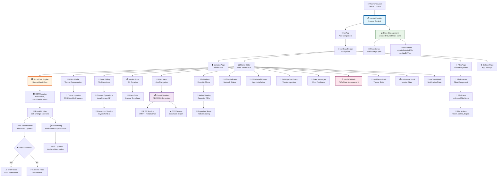
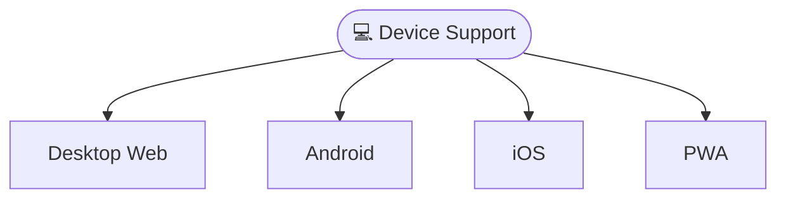
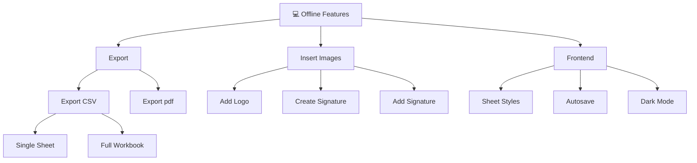
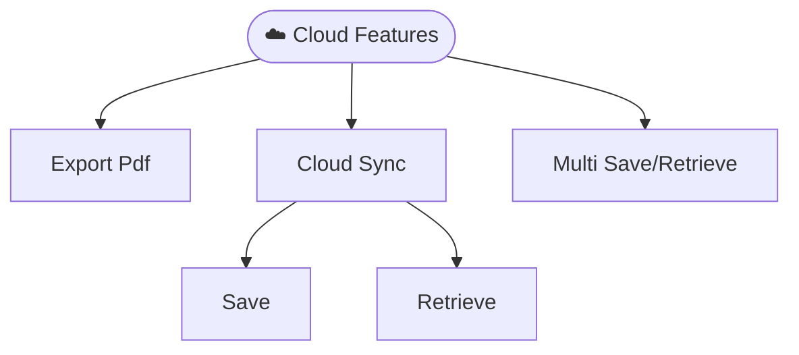
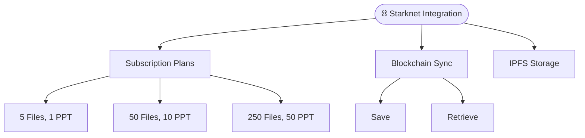

# 🏛️ Government Medical Billing Form

A comprehensive Progressive Web Application (PWA) built with Ionic 8 and React for government invoice billing with advanced offline capabilities, modern UI/UX, and cross-platform compatibility.

## 🔄 Project Workflow Architecture

```mermaid
flowchart TD
    %% Application Entry Points
    A[🚀 App Entry Point<br/>main.tsx] --> B[📱 App Component<br/>App.tsx]
    B --> C[🎨 Theme Provider<br/>ThemeContext]
    B --> D[📋 Invoice Provider<br/>InvoiceContext]
    
    %% Main Application Structure
    C --> E[🏠 Landing Page<br/>LandingPage.tsx]
    D --> F[📊 Home Editor<br/>Home.tsx]
    D --> G[📁 Files Management<br/>FilesPage.tsx]
    D --> H[⚙️ Settings<br/>SettingsPage.tsx]
    
    %% SocialCalc Integration Hub
    F --> I[🧮 SocialCalc Engine<br/>components/socialcalc/]
    
    %% SocialCalc Core Architecture
    I --> J[🏗️ Core Module<br/>core/index.js]
    J --> K[📝 Constants<br/>constants.js]
    J --> L[⚡ Core Engine<br/>core.js]
    J --> M[🔢 Number Format<br/>format-number.js]
    J --> N[🧪 Formula Engine<br/>formula.js]
    J --> O[📋 Table Editor<br/>table-editor.js]
    J --> P[🎛️ Spreadsheet Control<br/>spreadsheet-control.js]
    
    %% SocialCalc Modules System
    I --> Q[🔧 Modules System<br/>modules/]
    Q --> R[🚀 Initialization<br/>init.js]
    Q --> S[📄 Sheet Management<br/>sheets.js]
    Q --> T[📤 Export System<br/>exporters.js]
    Q --> U[🎨 Formatting<br/>formatting.js]
    Q --> V[🖼️ Logo Management<br/>logos.js]
    Q --> W[📱 Device Detection<br/>device.js]
    Q --> X[⏱️ History Management<br/>history.js]
    Q --> Y[🔊 Event Listeners<br/>listeners.js]
    Q --> Z[💬 Prompts & Dialogs<br/>prompts.js]
    Q --> AA[🛠️ Utilities<br/>utils.js]
    Q --> BB[💾 Weight/Cache<br/>weight.js]
    Q --> CC[🧾 Invoice Templates<br/>invoice.js]
    
    %% Storage & Data Management
    F --> DD[💾 Local Storage<br/>Storage/LocalStorage.ts]
    DD --> EE[🔐 File Encryption<br/>CryptoJS AES]
    DD --> FF[📱 Capacitor Preferences<br/>Cross-platform Storage]
    
    %% Service Layer
    F --> GG[📊 Export Services<br/>services/]
    GG --> HH[📄 PDF Export<br/>exportAsPdf.ts]
    GG --> II[📊 CSV Export<br/>exportAsCsv.ts]
    GG --> JJ[📑 Multi-sheet PDF<br/>exportAllSheetsAsPdf.ts]
    GG --> KK[🗂️ Bulk PDF Export<br/>exportAllAsPdf.ts]
    
    %% Component Integration
    F --> LL[🎛️ UI Components<br/>components/]
    LL --> MM[📋 Invoice Form<br/>InvoiceForm.tsx]
    LL --> NN[📁 File Browser<br/>Files/Files.tsx]
    LL --> OO[🍔 App Menu<br/>Menu/Menu.tsx]
    LL --> PP[📂 File Options<br/>FileMenu/FileOptions.tsx]
    
    %% PWA Features
    F --> QQ[🌐 PWA Features<br/>hooks/usePWA.ts]
    QQ --> RR[📲 Install Prompt<br/>PWAInstallPrompt.tsx]
    QQ --> SS[📴 Offline Indicator<br/>OfflineIndicator.tsx]
    QQ --> TT[🔄 Update Prompt<br/>PWAUpdatePrompt.tsx]
    
    %% Data Flow
    R --> UU[🔄 Auto-save System]
    UU --> DD
    T --> GG
    S --> MM
    V --> LL
    
    %% External Integration Points
    QQ --> VV[📱 Capacitor Plugins<br/>Camera, Filesystem, Share]
    GG --> WW[📤 Native Sharing<br/>Mobile & Desktop]
    
    %% Styling & Theme
    C --> XX[🎨 CSS Variables<br/>theme/variables.css]
    XX --> YY[🌙 Dark/Light Mode<br/>Dynamic Theming]
    
    style I fill:#e1f5fe,stroke:#01579b,stroke-width:3px
    style J fill:#fff3e0,stroke:#e65100,stroke-width:2px
    style Q fill:#f3e5f5,stroke:#4a148c,stroke-width:2px
    style DD fill:#e8f5e8,stroke:#1b5e20,stroke-width:2px
    style GG fill:#fff8e1,stroke:#e65100,stroke-width:2px
    style QQ fill:#fce4ec,stroke:#880e4f,stroke-width:2px
```



## 🧮 SocialCalc Engine Deep Dive

```mermaid
flowchart LR
    %% User Interactions
    A[👤 User Actions<br/>Cell Edit, Format, Save] --> B[🎛️ Event Listeners<br/>listeners.js]
    
    %% Core Processing
    B --> C{🔍 Action Type}
    C -->|Cell Edit| D[📝 Table Editor<br/>table-editor.js]
    C -->|Formula| E[🧪 Formula Engine<br/>formula.js]
    C -->|Format| F[🎨 Formatting Module<br/>formatting.js]
    C -->|Save| G[💾 Sheet Management<br/>sheets.js]
    C -->|Export| H[📤 Export System<br/>exporters.js]
    
    %% Core Engine Processing
    D --> I[⚡ Core Engine<br/>core.js]
    E --> I
    F --> I
    I --> J[📊 Spreadsheet Control<br/>spreadsheet-control.js]
    
    %% Data Management
    G --> K[💾 Local Storage<br/>LocalStorage.ts]
    K --> L[🔐 Encryption<br/>AES Encryption]
    K --> M[📱 Capacitor Preferences<br/>Cross-platform Storage]
    
    %% Export Pipeline
    H --> N{📋 Export Format}
    N -->|PDF| O[📄 PDF Service<br/>exportAsPdf.ts]
    N -->|CSV| P[📊 CSV Service<br/>exportAsCsv.ts]
    N -->|Multi-PDF| Q[📑 Bulk PDF Service<br/>exportAllSheetsAsPdf.ts]
    
    %% UI Updates
    J --> R[🖼️ DOM Updates<br/>Table Rendering]
    R --> S[🎨 Theme Application<br/>CSS Variables]
    
    %% Auto-save Flow
    I --> T[⏱️ Auto-save Timer<br/>Debounced Save]
    T --> U[🔄 Auto-save Handler<br/>handleAutoSave()]
    U --> K
    
    %% History Management
    I --> V[📚 History Module<br/>history.js]
    V --> W[↩️ Undo/Redo<br/>Action Stack]
    
    %% Logo & Branding
    F --> X[🖼️ Logo Module<br/>logos.js]
    X --> Y[📷 Image Processing<br/>Canvas Manipulation]
    
    %% Device Adaptation
    B --> Z[📱 Device Module<br/>device.js]
    Z --> AA[📏 Responsive Layout<br/>Mobile/Desktop UI]
    
    %% Progress & Feedback
    O --> BB[📊 Progress Tracking<br/>onProgress Callbacks]
    P --> BB
    Q --> BB
    BB --> CC[🔔 Toast Notifications<br/>User Feedback]
    
    style I fill:#ffcdd2,stroke:#c62828,stroke-width:3px
    style H fill:#c8e6c9,stroke:#2e7d32,stroke-width:2px
    style K fill:#bbdefb,stroke:#1565c0,stroke-width:2px
    style V fill:#f8bbd9,stroke:#ad1457,stroke-width:2px
```

## 🔄 Data Flow & State Management

```mermaid
flowchart TD
    %% Initial Data Load
    A[🚀 App Initialization<br/>useEffect in Home.tsx] --> B{📁 Default File Exists?}
    B -->|Yes| C[📖 Load from Storage<br/>store._getFile('default')]
    B -->|No| D[🆕 Create from Template<br/>DATA.home.App.msc]
    
    %% Data Processing
    C --> E[🔓 Decode Content<br/>decodeURIComponent()]
    D --> F[📝 Initialize SocialCalc<br/>initializeApp(data)]
    E --> G[📊 Load into SocialCalc<br/>viewFile(content)]
    F --> G
    
    %% State Management Hub
    G --> H[🏪 Invoice Context<br/>selectedFile, billType, store]
    H --> I[💾 LocalStorage Persistence<br/>React useState + useEffect]
    
    %% User Interactions
    I --> J[👤 User Actions]
    J --> K{🎯 Action Type}
    
    %% Cell Operations
    K -->|Cell Edit| L[📝 SocialCalc Cell Update]
    L --> M[🔄 Auto-save Trigger<br/>Cell Change Listener]
    M --> N[⏲️ Debounced Save<br/>1 second delay]
    N --> O[💾 Encode & Store<br/>encodeURIComponent()]
    O --> P[🗄️ Capacitor Preferences<br/>Cross-platform Storage]
    
    %% File Operations
    K -->|Save As| Q[📝 File Name Input<br/>IonAlert Dialog]
    Q --> R[🆕 Create New File<br/>File Object]
    R --> S[🔐 Optional Encryption<br/>AES if password set]
    S --> P
    
    %% Export Operations
    K -->|Export| T{📤 Export Type}
    T -->|PDF| U[📄 HTML to Canvas<br/>html2canvas]
    U --> V[📑 Canvas to PDF<br/>jsPDF]
    V --> W[📲 Native Share<br/>Capacitor Share API]
    
    T -->|CSV| X[📊 SocialCalc CSV Export<br/>ConvertSaveToOtherFormat()]
    X --> Y[💾 File Download<br/>Browser/Mobile]
    
    %% Theme & UI State
    H --> Z[🎨 Theme Context<br/>isDarkMode]
    Z --> AA[🌙 CSS Variables<br/>Dynamic Theme Application]
    AA --> BB[🎯 DOM Updates<br/>Real-time UI Changes]
    
    %% PWA State
    H --> CC[🌐 PWA Context<br/>isOnline, isInstallable]
    CC --> DD[📴 Offline Handling<br/>Service Worker]
    DD --> EE[🔄 Background Sync<br/>When Online]
    
    %% Error Handling
    P --> FF{❌ Storage Error?}
    FF -->|Quota Exceeded| GG[⚠️ Quota Warning<br/>Toast Notification]
    FF -->|Success| HH[✅ Success Feedback<br/>Toast Notification]
    
    %% File Loading
    J -->|Load File| II[📂 File Selection<br/>FilesPage.tsx]
    II --> JJ[📖 Read from Storage<br/>store._getFile(name)]
    JJ --> KK[🔓 Decrypt if needed<br/>Password validation]
    KK --> E
    
    %% Backup & Sync
    P --> LL[☁️ Optional Cloud Sync<br/>Future Enhancement]
    LL --> MM[⛓️ Blockchain Storage<br/>Starknet Integration]
    
    style H fill:#e1f5fe,stroke:#01579b,stroke-width:3px
    style P fill:#e8f5e8,stroke:#1b5e20,stroke-width:3px
    style L fill:#fff3e0,stroke:#e65100,stroke-width:2px
    style T fill:#f3e5f5,stroke:#4a148c,stroke-width:2px
    style CC fill:#fce4ec,stroke:#880e4f,stroke-width:2px
```

## 🧩 Component Interaction Map



The Government Billing Solution MVP is a modern, feature-rich billing application designed specifically for government agencies and public sector organizations. Built as a Progressive Web App, it provides a native app-like experience while maintaining web accessibility and cross-platform compatibility.

## Device Support (Web, Android, Ios, PWA)



## 🗂️ Project Structure

```
src/
├── components/           # Reusable UI components
│   ├── Files/           # File management components
│   ├── FileMenu/        # File operations menu
│   ├── Menu/            # Application menu
│   ├── socialcalc/      # Spreadsheet engine
│   └── Storage/         # Local storage management
├── contexts/            # React contexts for state management
├── hooks/               # Custom React hooks
├── pages/              # Main application pages
├── services/           # Application services
├── theme/              # CSS themes and variables
└── utils/              # Utility functions
```

# C4GT DMP'25 Contributions:

## ✨ Features Overview

### 🏠 Core Application Features


| #      | Feature                    | Description                                                               | Documentation                                           |
| ------ | -------------------------- | ------------------------------------------------------------------------- | ------------------------------------------------------- |
| **1**  | **Autosave Functionality** | Automatic saving with configurable intervals and manual save options      | [📄 View Details](.github/1.AUTOSAVE_FEATURE.md)        |
| **2**  | **Dark Mode Theme**        | Complete dark/light theme switching with system preference detection      | [📄 View Details](.github/2.DARK_MODE.md)               |
| **3**  | **Logo Integration**       | Company logo upload, management, and invoice integration                  | [📄 View Details](.github/3.ADD_LOGO_FEATURE.md)        |
| **4**  | **Advanced Cell Styling**  | Rich text formatting, colors, borders, and alignment options              | [📄 View Details](.github/4.SHEET_CELL_STYLING.md)      |
| **5**  | **Export Functionality**   | PDF, CSV, and multi-sheet export with mobile sharing support              | [📄 View Details](.github/5.CLIENT_EXPORT_FEATURES.md)  |
| **6**  | **Camera Integration**     | Photo capture for receipts and documentation using device camera          | [📄 View Details](.github/6.CAPACITOR_CAMERA_PLUGIN.md) |
| **7**  | **App Icons & Splash**     | Professional branding with adaptive icons and splash screens              | [📄 View Details](.github/7.APP_ICONS_SPLASH_SCREEN.md) |
| **8**  | **Digital Signatures**     | Electronic signature capture and integration into invoices                | [📄 View Details](.github/8.SIGNATURE_PLUGIN.md)        |
| **9**  | **Storage Management**     | Intelligent quota handling and storage optimization                       | [📄 View Details](.github/9.STORAGE_QUOTA_HANDLING.md)  |
| **10** | **PWA & Ionic 8 Upgrade**  | Progressive Web App capabilities with latest Ionic framework              | [📄 View Details](.github/10.PWA_IONIC_UPGRADE.md)      |
| **11** | **Bulk File Operations**   | Save all to server & move all from server with progress tracking          | [📄 View Details](.github/11.BULK_FILE_OPERATIONS.md)   |
| **12** | **Starknet Integration**   | Blockchain file storage with IPFS, token subscriptions, and Web3 features | [📄 View Details](.github/12_STARKNET_INTEGRATION.md)   |


## 1. Offline Features

## 2. Cloud Features (AWS S3)

## 3. Blockchain Integration (Starknet)


### 📱 Progressive Web App Features

- **Offline Functionality**: Full app functionality without internet connection
- **App Installation**: Install directly from browser with native app experience
- **Background Sync**: Sync data when connection is restored
- **Push Notifications**: Local notifications for important events
- **App Shortcuts**: Quick access to create invoice, view invoices, and manage customers
- **Standalone Display**: Full-screen app experience when installed
- **App-like UI**: Native-feeling interface with proper theming
- 
#### 📊 Performance Metrics

- **Load Times**: Measure initial load and navigation performance
- **Cache Hit Rates**: Monitor offline capability effectiveness
- **Storage Usage**: Track local storage and quota usage

## 🛠️ Technology Stack

### Frontend Framework

- **React 18.2.0** - Modern UI library with hooks and concurrent features
- **TypeScript 5.1.6** - Type-safe development environment
- **Ionic 8.0.0** - Cross-platform UI components and native app features
- **Vite 5.0.0** - Fast build tool and development server

### PWA & Mobile

- **Vite PWA Plugin 0.19.0** - Progressive Web App capabilities
- **Capacitor 6.0.0** - Native app deployment for iOS and Android
- **Capacitor Plugins** - Camera, filesystem, preferences, and sharing capabilities

### Spreadsheet Engine

- **SocialCalc** - Powerful spreadsheet engine for invoice creation and calculation
- **Custom Extensions** - Enhanced functionality for government billing needs


## 🚀 Quick Start

### Prerequisites

- **Node.js 16+** (LTS recommended)
- **npm 8+** or **yarn 1.22+**

### Installation

```bash
# Clone the repository
git clone https://github.com/<your_username>/<repo_name>.git
cd <repo_name>

# Install dependencies
npm install

# Generate PWA assets (icons, manifest)
npm run generate-pwa-assets

# Start development server
npm run dev
or ionic serve

# Build for production
npm run build
or ionic build

# Preview production build
npm run preview
```

### Mobile Development

```bash
# Add Capacitor (if not already added)
ionic integrations enable capacitor

# Add mobile platforms
npx cap add android
npx cap add ios

# Sync web app with native platforms
npx cap sync

# Open in native IDEs
npx cap open android
npx cap open ios

# (Optional) Run on mobile
ionic capacitor run android -l --external
ionic capacitor run ios -l --external
```

## 🤝 Contributing

1. Fork the repository
2. Create your feature branch (`git checkout -b feature/AmazingFeature`)
3. Commit your changes (`git commit -m 'Add some AmazingFeature'`)
4. Push to the branch (`git push origin feature/AmazingFeature`)
5. Open a Pull Request

## 📄 License

This project is licensed under the MIT License - see the [LICENSE](LICENSE) file for details.

## 🙏 Acknowledgments

- Built with [Ionic Framework](https://ionicframework.com/)
- Powered by [React](https://reactjs.org/)
- Spreadsheet functionality by [SocialCalc](https://socialcalc.org/)
- PWA capabilities with [Vite PWA Plugin](https://vite-pwa-org.netlify.app/)

## 📞 Support

For support, email the Contributor [anis42390@gmail.com] or create an issue in this repository.

---

**Made with ❤️ under C4GT DMP'25 Program**
